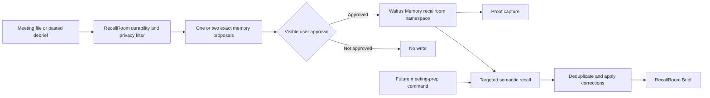

# RecallRoom

**Never walk into a meeting cold.**

RecallRoom is a Walrus Memory-powered meeting-prep agent. It turns meeting transcripts or debriefs into one or two durable, reusable relationship memories, asks the user to approve the exact records, and recalls the right promises, objections, preferences, decisions, risks, and follow-ups before later calls.

## The problem

Relationship context fragments across transcripts, notes, chats, CRMs, and human memory. Before recurring meetings, people forget commitments, repeat resolved objections, reopen settled decisions, and miss stakeholder preferences. Traditional meeting summaries describe what happened once; they do not reliably identify the few facts worth carrying into a future session.

RecallRoom is designed for founders, consultants, freelancers, sales and account teams, recruiters, researchers, and project leads who repeatedly meet the same people and organizations.

## Why Walrus Memory

Walrus Memory supplies persistent, portable semantic memory across agent sessions. RecallRoom uses the owner-and-namespace boundary to isolate its `recallroom` memories, writes compact approved facts, and semantically retrieves them in later sessions. Walrus stores encrypted content, while the managed relayer handles embedding, encryption, upload, and retrieval; that relayer remains a trust boundary, so RecallRoom deliberately minimizes what it stores.

## What it stores

RecallRoom stores atomic, future-useful facts: stakeholder preferences, promises, objections, decisions, unresolved risks, relationship notes, corrections, and follow-ups. Records include lifecycle fields for stable keys, supersession, owner, and due date. See [the memory policy](docs/memory-policy.md).

It refuses to store full transcripts, raw notes, secrets, credentials, payment data, unnecessary sensitive personal data, gossip, insults, or anything the user excludes. It is not a recorder, transcript archive, CRM replacement, or surveillance system.

## Architecture



Walrus Memory is the persistence and semantic-retrieval layer. RecallRoom is the policy and interaction layer that decides what is durable, obtains approval, records evidence, resolves changing facts, and produces meeting preparation.

## Quick start

### Prerequisites

- An MCP-capable client such as Codex.
- The official `@mysten-incubation/memwal-mcp` server configured for the intended environment.
- A Walrus Memory account and registered delegate for live writes.
- The full [canonical prompt](PROMPT.md) loaded as the agent or system prompt.

Check which `memwal_*` tools the client actually exposes. RecallRoom adapts to the available surface and does not assume optional bulk, analyze, restore, or health tools exist. Never commit local MCP configuration or credentials.

### Validate this repository

```bash
python3 scripts/validate_repo.py
scripts/check.sh
```

These checks are dependency-free and do not call Walrus Memory.

## Natural-language commands

```text
RecallRoom ingest meeting: meetings/raw/bluecart-01-initial-call.md
RecallRoom ingest this meeting note: Asha asked for a written privacy summary before the review.
APPROVE WALRUS WRITES FOR THIS MEETING
RecallRoom prep me for Asha Raman at BlueCart.
RecallRoom recall only: BlueCart privacy objections and Omar's technical review.
RecallRoom update: the security summary was sent and Omar requested a technical review.
```

## Ingestion and approval

For a file-ingestion command, RecallRoom reads the file as source material, omits raw text and sensitive content, and shows one or two complete proposed records. It does not write yet. The user reviews those exact records and, only when satisfied, replies:

`APPROVE WALRUS WRITES FOR THIS MEETING`

Approval applies only to the proposals just shown. After approval, RecallRoom uses the exposed write capability, captures every returned identifier and status immediately, allows for indexing lag, and verifies distinctive content through recall. A timeout triggers recall before any retry because background processing can outlive a client timeout.

## Recall and meeting prep

Meeting prep always starts with `memwal_recall`. RecallRoom may use separate queries for attendee/company context, promises and follow-ups, preferences and objections, and decisions, risks, and corrections. It deduplicates results and treats explicit corrections, newer dates, active status, and confidence as ranking signals before producing:

```text
RecallRoom Brief

Attendees and known context:
What they care about:
Prior promises and follow-ups:
Open objections or risks:
Decisions already made:
Recommended agenda:
Suggested opener:
Things to avoid:
Next best action:
```

If recall finds nothing, RecallRoom says so rather than inventing history.

## Memory lifecycle

A stable `MEMORY_KEY` groups one logical fact through time, while each version has a unique `MEMORY_ID`. Completing a promise creates a resolved record whose `SUPERSEDES` field points to the active version's ID. A changed preference creates a newer record linked to the exact prior version; history remains available but no longer drives current guidance.

For example, Asha may initially reject unstructured demos. If she later accepts a focused demo after receiving a written agenda, the newer preference controls prep and the earlier preference remains historical. Corrections never silently overwrite the past.

## Reproducible demo

The repository includes five explicitly fictional BlueCart meetings under [`meetings/raw`](meetings/raw/) and expected behavior under [`meetings/expected`](meetings/expected/). A no-write dry run is:

1. Run `RecallRoom ingest meeting: meetings/raw/bluecart-01-initial-call.md`.
2. Confirm the agent proposes no more than two durable records and asks for the canonical approval phrase without writing.
3. Explain that approval would invoke exposed write tools and capture proof; do not approve during a repository-only dry run.
4. Review the expected cumulative behavior in [expected recall results](meetings/expected/expected-recall-results.md).
5. In an authorized live demo, approve distinct synthetic memories, then start a fresh task and run `RecallRoom prep me for Asha Raman at BlueCart.`

The [behavioral test matrix](tests/behavioral-test-matrix.md) covers empty recall, duplicate prevention, conflicts, corrections, privacy, tool absence, organization isolation, and cumulative prep. The [no-write dry-run report](tests/dry-run-report.md) records the exact proposal-only journey validated during this refactor.

## Verified staging proof

Staging/testnet verification is **PASS**. One project-state write was confirmed with testnet blob ID `vGJpVJ8AD3a2wngBpgAhuD7sNBCBpbHoSjLTAU5jbfQ`, and a later recall returned score `0.644`. A separate Asha/BlueCart recall returned score `0.766`, although its original write response and blob ID were not captured. These are testnet-only identifiers and are not submission proof. See the [staging report](proof/staging-verification-report.md).

## Mainnet and submission status

Mainnet proof is **incomplete**. No Mainnet identifiers, writes, wallet operations, or form submission were performed during this refactor. Official Prompt Jam rules require at least 10 Mainnet blobs, the delegate public key as `MEMWAL_AGENT_ID`, a MemWalAccount explorer link, a dedicated Sessions wallet, and a Walrus-hosted demo of 3 minutes or less. See [submission requirements](docs/submission-requirements.md), the [Mainnet proof template](proof/mainnet-proof.md), and the [Mainnet runbook](proof/mainnet-runbook.md).

## Privacy and limitations

- Human approval reduces accidental writes but does not validate every fact automatically.
- Semantic recall can return irrelevant matches; organization, identity, date, status, and correction checks remain necessary.
- The managed relayer handles plaintext during embedding/encryption, so users with stricter trust needs should evaluate official manual or self-hosted paths.
- Walrus writes incur network cost and are not inherently deduplicated.
- RecallRoom does not delete or overwrite historical memory through this prompt; it models correction and supersession explicitly.

## Repository layout

| Path | Purpose |
|---|---|
| [`PROMPT.md`](PROMPT.md) | Canonical copy-pasteable RecallRoom prompt. |
| [`AGENTS.md`](AGENTS.md) | Codex repository and proof-capture rules. |
| [`docs`](docs/) | Product, memory-policy, and verified submission requirements. |
| [`meetings`](meetings/) | Synthetic meeting sequence and expected behavior. |
| [`proof`](proof/) | Staging evidence, Mainnet template/runbook, and form audit. |
| [`tests`](tests/) | Behavioral test matrix. |
| [`scripts`](scripts/) | Dependency-free synchronization and validation. |
| [`SUBMISSION_DRAFT.md`](SUBMISSION_DRAFT.md) | Form-ready draft synchronized with the canonical prompt. |

## Submission status

The prompt, documentation, fixtures, and local validation are prepared for proof collection. Mainnet proof, demo upload, DeepSurge submission, X post, and WalForm submission remain intentionally incomplete. See the [submission draft](SUBMISSION_DRAFT.md).
